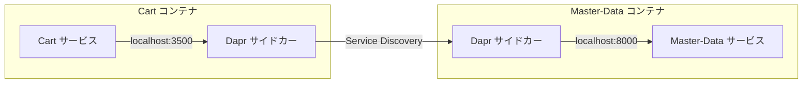

## はじめに

前回の記事では、マイクロサービスが抱える3つの課題と、Daprによる解決策の全体像をお話ししました。今回はその**泣きどころ①「通信の複雑さ」**を解決するService Invocation（サービス間通信）を深掘りします。

マイクロサービスにおいて、サービス同士が通信することは日常です。しかし、その「通信」には想像以上に多くの課題が潜んでいます。KugelPOSではDaprのService Invocationを活用して、これらの課題をアプリケーションの外側で解決しています。

## サービス間通信の3つの課題


### 課題1: 相手の居場所が変わる

モノリスのシステムでは、すべての機能が同じプロセス内にあるため、関数を呼ぶだけで済みました。しかしマイクロサービスでは、呼び出し先は別のコンテナ、別のサーバー、場合によっては別のデータセンターにいます。

さらに厄介なのは、その居場所が変わることです。コンテナが再起動すればアドレスが変わり、スケールアウトすればインスタンスが増え、障害が起これば別のノードに移動します。呼び出し側が相手のアドレスを固定的に持っていると、相手が移動するたびにシステムが壊れます。

### 課題2: 通信は失敗するもの

ネットワーク越しの通信は、常に失敗する可能性があります。タイムアウト、接続拒否、一時的なネットワーク障害。これらは例外的な事態ではなく、日常的に起きることです。

各サービスが自前でリトライ処理、タイムアウト制御、エラーハンドリングを実装すると、どうなるでしょうか。同じようなコードが全サービスに散らばり、実装の品質にバラツキが生まれ、メンテナンスの負担が増大します。

### 課題3: 開発環境と本番環境の一貫性

マイクロサービスでは「開発環境では動くのに本番では動かない」という問題がしばしば発生します。サービス間通信のルーティング、サービスディスカバリ、ミドルウェアの構成など、環境ごとに差異があると、本番デプロイ時に初めて発覚する障害が起きかねません。開発時から本番と同じ構成で動作確認できる仕組みが重要です。

## Dapr Service Invocationの仕組み


### 名前で呼ぶ、Daprが届ける

Service Invocationの基本的な考え方はシンプルです。呼び出し側は、相手の「名前」だけを指定します。相手のアドレスもポート番号も知る必要はありません。隣にいるDaprサイドカーに「この名前のサービスに、このリクエストを届けてほしい」と依頼するだけです。

Daprが裏側で行うことは以下の通りです。

1. **サービスの発見** — 指定された名前のサービスがどこにいるかを自動的に解決する
2. **リクエストの転送** — 相手のDaprサイドカーにリクエストを転送する
3. **リトライ** — 一時的な障害が発生した場合、自動的にリトライする
4. **暗号化** — サービス間の通信をmTLSで暗号化する（本番環境）

### URLパターン

Dapr Service Invocationでは、以下のURLパターンでサービス間通信を行います。

```
http://localhost:3500/v1.0/invoke/{サービス名}/method/{エンドポイント}
```

すべてのリクエストは `localhost:3500`（隣にいるDaprサイドカー）に送られます。URLに含まれるサービス名をもとに、Daprが宛先を解決してリクエストを転送します。

### 呼び出しの流れ

KugelPOSでCartサービスがMaster-Dataサービスの商品情報を取得する場面を例に、実際の流れを追ってみましょう。



- Cartサービスが、隣のDaprサイドカーに「master-dataサービスの商品APIを呼んでほしい」とリクエストを送る
- CartのDaprサイドカーが、ネットワーク上でmaster-dataサービスのDaprサイドカーを発見する
- Master-DataのDaprサイドカーが、隣のMaster-Dataサービスにリクエストを転送する
- 応答が逆のルートで返ってくる

Cartサービスのコードには「Master-Dataがどのサーバーの何番ポートで動いているか」という情報は一切含まれません。「master-data」という名前だけです。

## KugelPOSでの実践

### 7サービスの通信マップ


KugelPOSの7つのマイクロサービスは、それぞれが業務上必要な相手とService Invocationで通信しています。

| 呼び出し元 | 呼び出し先 | 主な用途 |
|---|---|---|
| Terminal | Master-Data, Cart | スタッフ・店舗情報の参照、取引ログの取得 |
| Cart | Terminal, Master-Data | 端末情報の取得、商品マスタの参照 |
| Master-Data | Terminal | 端末設定の参照 |
| Report | Terminal, Cart, Journal | レポート生成に必要なデータの参照 |
| Journal | Terminal, Cart | 電子ジャーナル生成に必要なデータの参照 |
| Stock | Terminal, Master-Data, Cart | 在庫更新に必要な情報の参照 |

Terminalサービスはレジ業務の起点ですが、Service Invocationによる同期通信の相手はMaster-DataとCartに限られます。Report・Journalへのデータ配信は、第3回で取り上げるPub/Sub（非同期通信）で行っています。同期通信と非同期通信を業務特性に応じて使い分けている点が、KugelPOSの設計の特徴です。

### Docker Composeでのサイドカー配置


KugelPOSでは `network_mode: "service:cart"` により、Daprサイドカーコンテナがアプリケーションコンテナとネットワーク名前空間を共有しています。これにより互いに `localhost` で通信できます。

```yaml
# docker-compose.yaml（Cart サービスの例）
cart:
    build:
      context: ./cart
    environment:
      - BASE_URL_DAPR=http://localhost:3500/v1.0
      - BASE_URL_TERMINAL=http://localhost:3500/v1.0/invoke/terminal/method/api/v1
      - BASE_URL_MASTER_DATA=http://localhost:3500/v1.0/invoke/master-data/method/api/v1
    ports:
      - "8003:8000"
    command: ["uvicorn", "app.main:app", "--host", "0.0.0.0", "--port", "8000"]

dapr_cart:
    image: daprio/daprd:latest
    command: ["./daprd", "-app-id", "cart", "-app-port", "8000",
              "-dapr-http-port", "3500",
              "-config", "/dapr/config.yaml",
              "-components-path", "./dapr/components"]
    depends_on:
      - cart
      - redis
    network_mode: "service:cart"   # Cart コンテナとネットワークを共有
```

### 開発環境と本番環境の一貫性


サービス間通信のURLは `WebServiceSettings` で一元管理されています。

```python
# commons/src/kugel_common/config/settings_web.py
class WebServiceSettings(BaseSettings):
    BASE_URL_DAPR: str = "http://localhost:3500/v1.0"
    BASE_URL_MASTER_DATA: str = "http://localhost:8002/api/v1"
    BASE_URL_TERMINAL: str = "http://localhost:8001/api/v1"
    BASE_URL_CART: str = "http://localhost:8003/api/v1"
    BASE_URL_REPORT: str = "http://localhost:8004/api/v1"
    BASE_URL_JOURNAL: str = "http://localhost:8005/api/v1"
    BASE_URL_STOCK: str = "http://localhost:8006/api/v1"
```

Docker Composeの `environment` セクションで、すべてのURLをDapr経由に上書きします。アプリケーションのコードは一行も変わりません。環境変数で通信経路を制御するため、開発環境・ステージング・本番で同じコードがそのまま動きます。

## Service Invocationがもたらす効果

**サービス間の疎結合。** 各サービスは相手の名前だけを知っていれば通信できます。相手がどこで動いているか、何台で動いているかは関心の外です。

**開発と本番の一貫性。** ローカル開発でもDocker Composeで本番同様のDapr構成を再現するため、環境差異による問題を構造的に排除しています。

**運用の簡素化。** サービスディスカバリ、リトライ、通信の暗号化がDaprレイヤーで自動的に処理されるため、各サービスの開発者はこれらのインフラ的な関心事から解放されます。

## おわりに

サービス間通信は、マイクロサービスにおいて最も基本的で、最も頻繁に発生する処理です。だからこそ、その課題を個々のサービスに押し付けるのではなく、Daprという共通のランタイムに委ねることの効果は大きいのです。

次回は、Pub/Sub（パブリッシュ/サブスクライブ）を取り上げます。「レジを止めない」ために、同期処理から非同期処理への転換がなぜ必要で、KugelPOSではどのように実現しているかをお話しします。


**KugelPOS Backend Services**
GitHub: https://github.com/kugel-masa/kugelpos-backend
ライセンス: Apache 2.0
