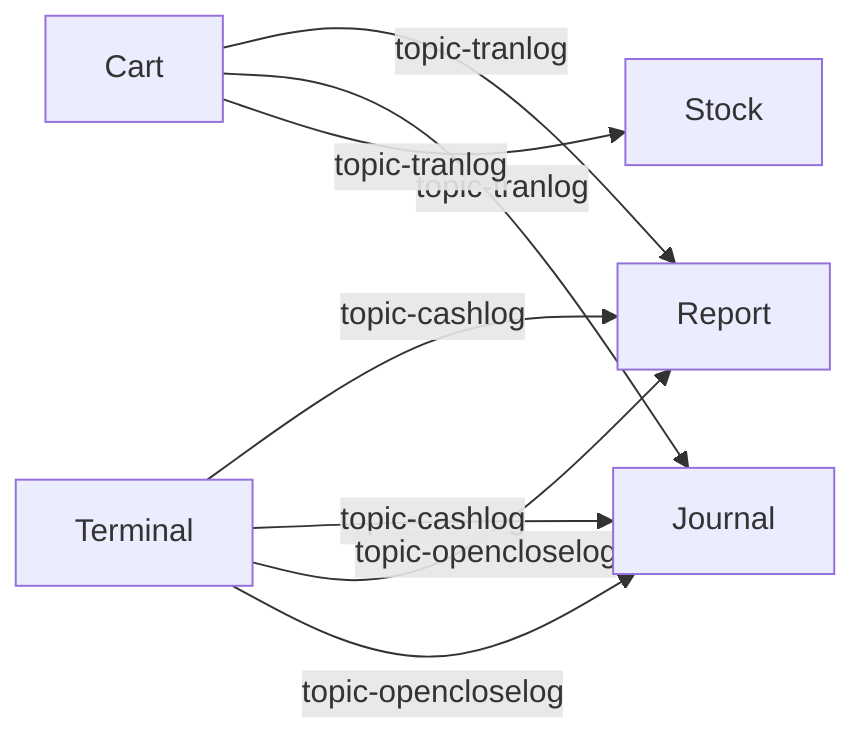

:::message
この記事の内容は動画でもご覧いただけます。
:::

## はじめに

前回はService Invocationによるサービス間通信を取り上げ、**泣きどころ①「通信の複雑さ」**を解決しました。Service Invocationは「AがBにリクエストを送り、応答を待つ」という同期的な通信です。多くの場面ではこれで十分ですが、POSシステムには同期通信では解決できない課題があります。

今回は**泣きどころ②「同期の呪縛」**を解決するDaprのPub/Sub（パブリッシュ/サブスクライブ）による非同期メッセージングを深掘りします。「レジを止めない」ためになぜ非同期処理が必要なのか、そしてKugelPOSではどのように実現しているかをお話しします。

## なぜ「待たない」仕組みが必要か


### レジの1秒は長い

小売の現場では、レジの応答速度は直接的にお客様の体験に影響します。精算ボタンを押してから画面が切り替わるまでの時間が1秒長くなるだけで、1日に数百回の精算を処理するレジでは、累積の待ち時間は無視できないものになります。

お客様がレジで精算を完了したとき、システムの裏側では以下の処理が必要です。

1. トランザクションログの記録（売上データの蓄積）
2. 電子ジャーナルデータの作成（法的に必要な取引記録）
3. 在庫数の更新（販売した商品の在庫を減らす）

これらをすべて「待って」から画面を切り替えると、3つのサービスの処理時間の合計がそのままレジの待ち時間に加算されます。

### 障害の連鎖

同期通信のもう1つの深刻な問題は、障害が連鎖することです。1つのサービスの問題が、本来無関係なはずのレジ操作を巻き込む。レジが止まることは、小売の現場では最も深刻な障害です。

## Pub/Subの考え方


### 新聞の発行と購読

**新聞社（発行者）** は記事を書いて発行します。誰が読むかは知りません。

**読者（購読者）** は関心のある新聞を購読登録しておきます。新しい記事が発行されれば届きます。

**ポスト（メッセージキュー）** は新聞社と読者の間に立って、記事を預かり、各読者に届けます。

この仕組みの本質は「発行者と購読者が互いを知らない」ということです。

### 同期通信との違い

**同期通信（Service Invocation）:**
- AがBを呼び出し、Bの応答を待ってから次に進む
- Bの処理速度がAの速度に直結する
- Bが落ちるとAも影響を受ける

**非同期通信（Pub/Sub）:**
- Aはメッセージを発行した時点で次に進む
- Bの処理速度はAに影響しない
- Bが落ちてもAは影響を受けない（メッセージはキューに蓄積される）

## KugelPOSでの実践

### 3つのトピック、2つの発行者、3つの購読者




**トピック1: 売上トランザクション** — Cart → Report, Journal, Stock
**トピック2: 入出金ログ** — Terminal → Report, Journal
**トピック3: 開局/閉局ログ** — Terminal → Report, Journal

Cartサービスはイベントを発行した瞬間にレジ画面に応答を返します。Report、Journal、Stockの3サービスがどれだけ処理に時間がかかっても、レジの応答速度には影響しません。

### 再配信の仕組み


Daprは購読側のHTTPエンドポイントが返す**HTTPステータスコード**で成功・失敗を判断します。

| HTTPステータスコード | 購読側の意図 | Daprの動作 |
|---|---|---|
| 200（成功） | 処理が正常に完了した | メッセージをキューから削除 |
| 400（不正なリクエスト） | メッセージが不正で処理できない | メッセージを破棄（再配信しない） |
| 500（サーバーエラー） | 一時的な障害で処理できなかった | 一定時間後にメッセージを再配信 |

```python
# report/app/api/v1/tran.py — 応答の使い分け
if not event_id:
    return {"status": "DROP"}, 400       # 不正なメッセージ → 破棄

if already_processed:
    return {"status": "SUCCESS"}, 200    # 処理済み → 再配信を止める

try:
    await process_log(log_data)
    return {"status": "SUCCESS"}, 200
except Exception:
    return {"status": "RETRY"}, 500      # エラー → 再配信を要求
```

### 冪等性の保証

再配信の仕組みがある以上、同じメッセージが2回以上届く可能性があります。同じ売上トランザクションが2回処理されると、売上が二重計上されてしまいます。

KugelPOSでは、各メッセージに一意の「イベントID」を付与し、処理済みのイベントIDをDaprのState Storeに記録することで、この問題を解決しています。

```python
# report/app/api/v1/tran.py
async def handle_log(request, log_type, log_model, receive_method):
    message = await request.json()
    event_id = message.get("data", {}).get("event_id")

    if not event_id:
        return {"status": "DROP"}, 400          # event_id がなければ破棄

    # State Store で重複チェック
    result, _ = await state_store_manager.get_state(event_id)
    if result:
        return {"status": "SUCCESS"}, 200       # 処理済みならスキップ

    # データを処理
    log_data = log_model(**message["data"])
    await receive_method(log_data)

    # 処理済みとして記録
    await state_store_manager.save_state(event_id, {"event_id": event_id})
    return {"status": "SUCCESS"}, 200
```

### 2層の配信保証

KugelPOSのトランザクション配信保証は、2つの層で構成されています。

| 層 | 担当 | 役割 |
|---|---|---|
| Daprレイヤー | Dapr Pub/Sub | HTTPステータスコードに基づく再配信。インフラレベルの配信保証 |
| アプリケーションレイヤー | KugelPOS独自実装 | 冪等性保証、サービス単位の到達確認、未到達の再発行、アラート通知 |

POSシステムにおいて「1件も漏らさない」というのは機能要件であり、KugelPOSはそれをアーキテクチャレベルで保証しています。

## Pub/Subがもたらす効果


**レジの高速応答。** 精算処理の完了後、イベントを発行した瞬間にレジ画面に応答を返せます。

**障害の分離。** Report、Journal、Stockのいずれかがダウンしても、レジは正常に稼働し続けます。

**拡張の容易さ。** 新しいサービスをトピックの購読者として追加するだけで、既存のコードを変更せずにデータの配信先を増やせます。

**トランザクションの配信保証。** Daprレイヤーの再配信に加え、アプリケーションレイヤーでの到達確認・再発行・アラート通知により、売上トランザクションが1件も漏れない仕組みを実現しています。

## おわりに

Pub/Subは「待たない」通信を実現する仕組みです。発行者はメッセージを投げたら先に進み、購読者はそれぞれのペースで処理する。この非同期の仕組みが、「レジを止めない」というPOSシステムの最重要要件を支えています。

次回は、State Store（状態ストア）を取り上げます。レジの応答速度を高速化するキャッシュの仕組みと、インフラに依存しない状態管理がKugelPOSでどのように活用されているかをお話しします。


**KugelPOS Backend Services**
GitHub: https://github.com/kugel-masa/kugelpos-backend
ライセンス: Apache 2.0
